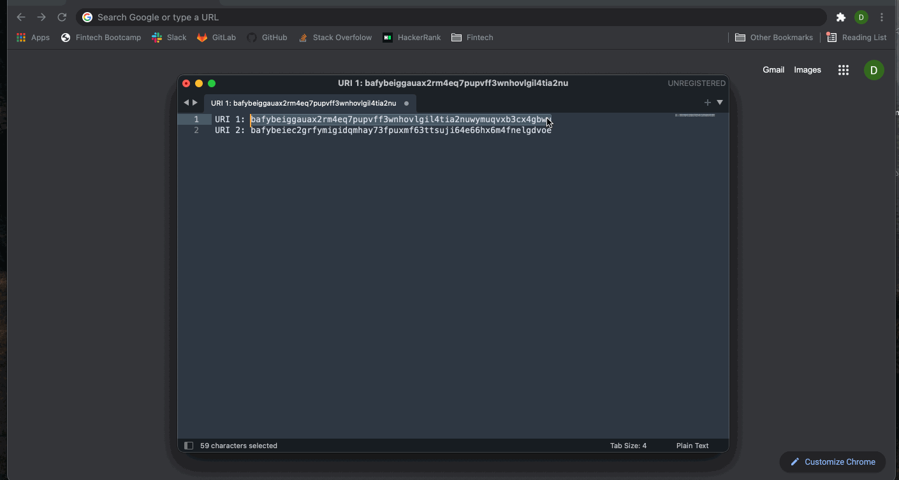
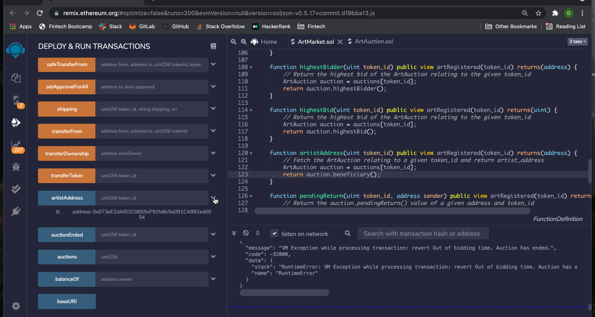

# Myad Market

Online commerce presents buyers with a vast world of convenience and speed, however the current leading online art marketplaces are not very beneficial for sellers.  As more commerce transitions online, it is only natural that disintermediation will reach art marketplaces. Companies like Etsy and eBay are making a large profit on small and big artists alike.  Not only are they taking cuts from every sale, but they are introducing layers of friction that can be removed with blockchain and NFTs.  Myad Market creates an efficient peer-to-peer marketplace for artists to sell directly to buyers in a more open and equitable way. 

Myad Market allows anyone to mint their own artwork and auction it off directly to consumers on the blockchain, increasing transparency while delivering more money back to the original artist.  

The following code contains two solidity smart contracts: ArtAuction.sol and ArtMarket.sol. ArtAuction contains code to execute each individual auction including functionality for bidding, withdrawing bids, auction timers, transfering funds and reseting the auction if necessary.  ArtMarket includes the functionality of ArtAuction as well as the marketplace including creating auctions, registering art, ending auctions, shipping, returning art and customer satisfaction.

This platform allows for the safe registration, sale, and transfer of physical artwork online through a digital marketplace via a ART token.  There are many potential applications beyond artwork.  This method can be efficiently applied to the sale and transfer of anything online.  This allows for disintermediation as well as increased transparency, traceability, security, privacy and speed at a low cost for all users of the Myad Marketplace blockchain.

---

## Technologies

Language: Solidity

Developed with [Remix](https://remix.ethereum.org/), [MetaMask](https://metamask.io/), and [Pinata](https://pinata.cloud/)

Tested on a local network using [Ganache](https://www.trufflesuite.com/docs/ganache/overview)

---

## Instructions
*Note: For the purpose of these instructions, bidding time has been set to two minutes. All demonstrations are performed on a local test network*

- Create a URI using Pinata for a json file containing artwork information.

- Register artwork with artwork URI and artist wallet address to mint ART token and create a new auction.

- Users can bid on artwork with Ether using the token ID until bidding time runs out.

- The artist will then ship the artwork to the highest bidder and input the shipping info as a URI. The auction house holds the token in escrow until the buyer recieves the artowrk and authenticity is verified.

- If the buyer reports as satisfied upon arrival of the artwork, the auction house will transfer the token to the buyer as proof of ownership and the funds to the artist (minus 3% commission to the auction house).

- If the buyer is unsatified with the artwork the must return the artwork to the artist. After the buyer inputs a return shipping URI, they report back to the auction house as unsatified and their funds are transfered back to their wallet. The auction house continues to hold the token and creates a new auction associated with the token ID.

---

## Contributors

Drew Disbrow Marnell: dldmarnell@gmail.com   
Yoko Yamamoto: yyamamo222@gmail.com   
Apexa Patel: apexa.dhirubhai@gmail.com   
Matt Epler: epler.matt@gmail.com

---

## License

MIT License
Copyright (c) 2021 Drew Disbrow Marnell